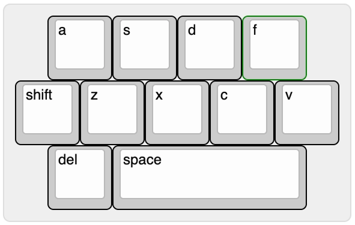
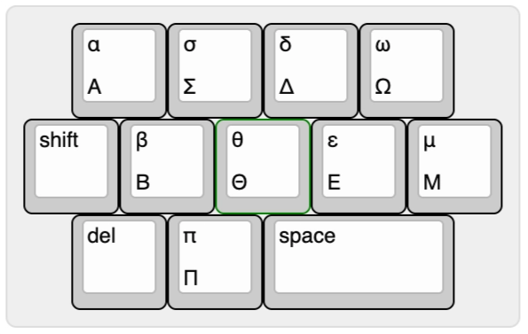

# Keyboard Layout

Date: May 21, 2026
Authors: Jingyuan Wen, Richard Ding

## Firmware???

Links: [QMK](https://docs.qmk.fm/newbs), and [QMK for RP2040](https://www.reddit.com/r/ErgoMechKeyboards/comments/1kuyt99/help_in_qmk_firmware_with_rp2040/)

---

### Windows vs. Mac

The control key on windows corresponds to the command key on Mac. How can we resolve this discrepancy in a macropad/keyboard?

1. Make two versions (one with ctrl, one with cmd)
    1. One version, two different flashes (basically option 1)
2. Post-flash customization? Kind of like the capslock key, maybe a ctrl/cmd key?

---

### Macropad v0 (Burgerpad) Possible Layouts

Here are some layouts we decided based on what we felt would feel natural to use. It also inspired us to change the project name from Macropad v0 to Burgerpad. (it kinda looks like a burger lol)

[Keyboard Layout Editor](https://www.keyboard-layout-editor.com/#/)

---



```cpp
[{x:0.5},"a", "s", "d", "f"],
["shift", "z", "x", "c", "v"],
[{x:0.5},"del", {w:3}, "space"]
```



```cpp
[{x:0.5},"α\nΑ", "σ\nΣ", "δ\nΔ", "ω\nΩ"],
["shift", "β\nΒ", "θ\nΘ", "ε\nΕ", "μ\nΜ"],
[{x:0.5},"del", "π\nΠ", {w:2}, "space"]

```
