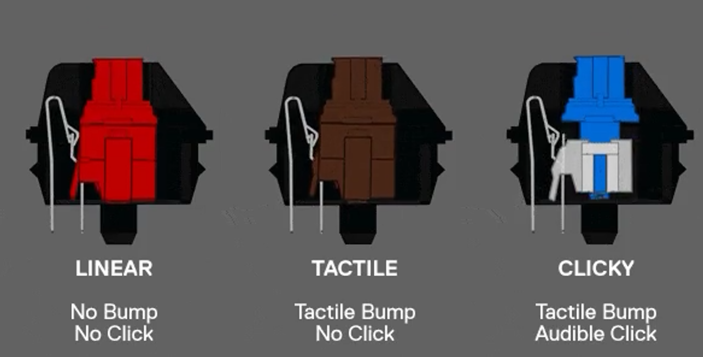
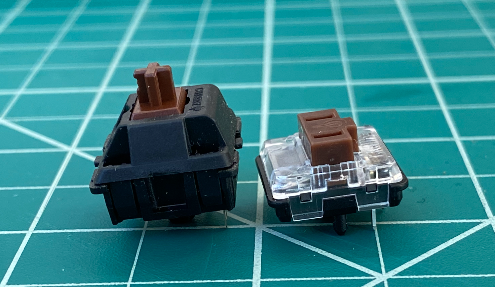
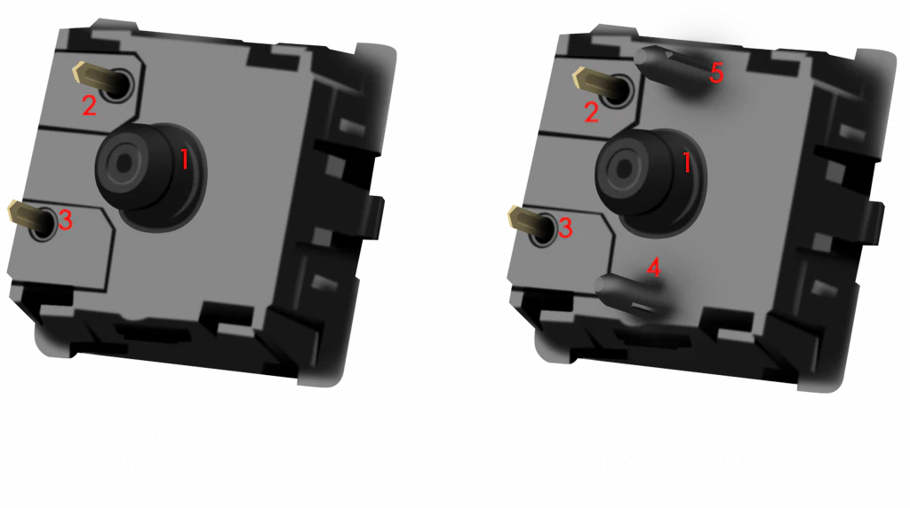

# Switches & Keys

Date: May 21, 2026

Authors: Jingyuan Wen, Richard Ding

## Types of Switches

### Feeling or Something idk

| **Type** | **Desc**. | Color (Usually) |
| --- | --- | --- |
| Linear | Straight, smooth downward motion. No clicks. | Red |
| Tactile | When you press down on it you can feel a click, but unlike clicky switches it’s more quiet. | Brown |
| Clicky | You’ll feel a click when pressing down on it and it makes a click sound. | Blue |

### Appearances or Something idk

| **Type** | **Desc.** |
| --- | --- |
| Choc | Shorter travel distance, the kind that you’d find in those low profile keyboards probably |
| MX | Stereotypical mechanical keyboard switch with the thick ahh keys |

MX switch at left, choc v1 switch at right

Note: There are two types of choc switches (v1 and v2) that have differing stems. V1 has the pig nose shaped stem while v2 has the cross shaped stem. This will affect the selection of key caps.

### Pins or Something idk

“Pins” refer to any kind of leg that comes out of a keyboard, whether electrical (the two nodes) or mechanical (plastic alignment/guiding pins).

There are two main types: 3-pin and 5-pin, and the main consideration is to ensure the PCB and the switch roughly match:

---

## Where to get Switches?

If you like money, go with AliExpress, but there are other legitimate sellers too

| Link | Price Range (per 100 switches) |
| --- | --- |
| [AliExpress](https://www.aliexpress.us/w/wholesale-keyboard-switch.html?spm=a2g0o.home.search.0) | $1-10 |
| [Amazon](https://www.amazon.com/s?k=mechanical+switches&crid=1B0EB3EIAGNNJ&sprefix=mechanical+switche%2Caps%2C198&ref=nb_sb_noss_2) | $10-30 |
| [Micro Center](https://www.microcenter.com/search/search_results.aspx?N=&cat=&Ntt=mechanical+switches&searchButton=search) | $30-50 |

---
